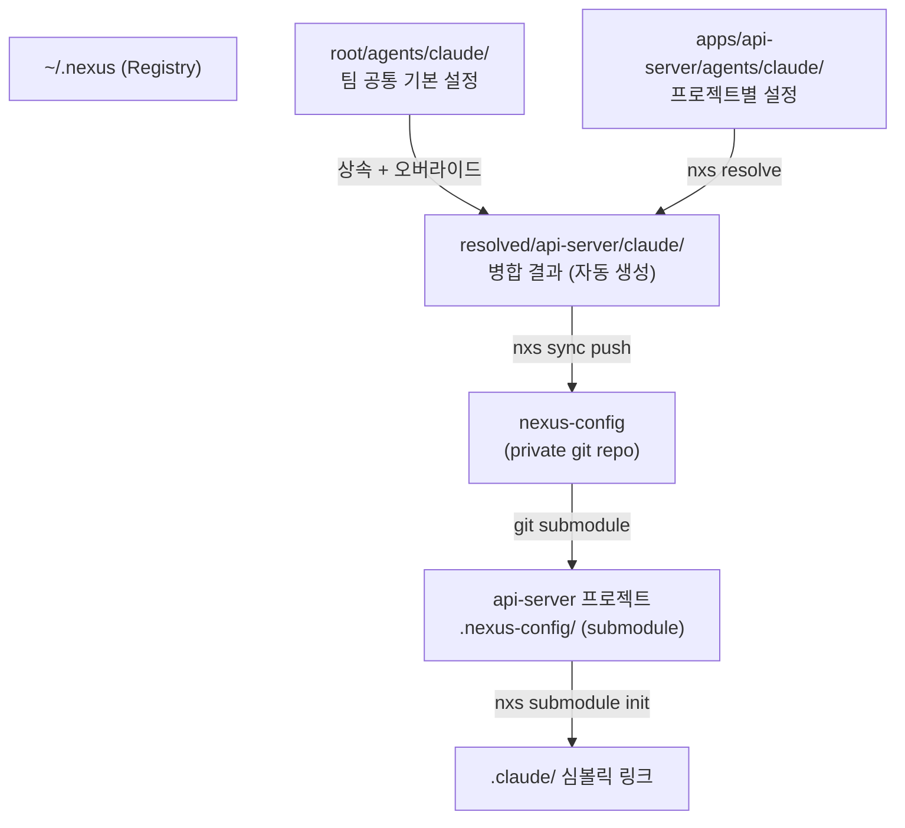
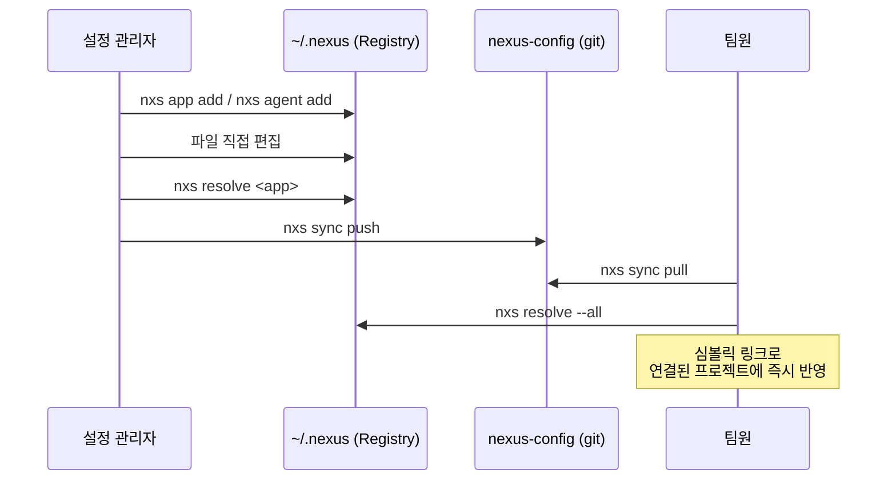
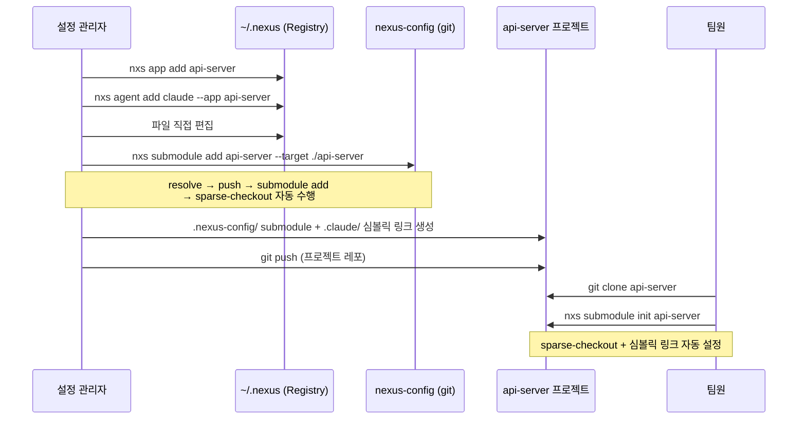
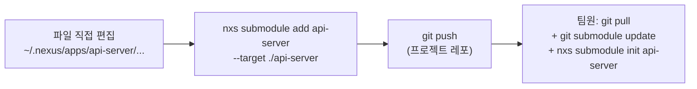

# Nexus CLI (`nxs`)

AI 에이전트(Claude, Gemini, Codex, Cursor, Copilot) 설정을 팀 전체에 중앙 관리하는 CLI 프레임워크.

## 개념 구조



## 설치

```bash
pipx install nexus-cli
```

## 빠른 시작

```bash
# Registry 초기화
nxs init

# 앱 등록
nxs app add web-frontend

# Claude 에이전트 설정 추가
nxs agent add claude --app web-frontend

# 설정 병합
nxs resolve web-frontend

# 프로젝트에 심볼릭 링크 연결
nxs link web-frontend --target /workspace/my-project
```

## 주요 명령어

| 명령어 | 설명 |
|--------|------|
| `nxs init` | Registry 초기화 |
| `nxs app add/list/show/remove` | 앱 관리 |
| `nxs agent add/list/show/remove` | 에이전트 설정 관리 |
| `nxs resolve <app>` | 설정 병합 빌드 |
| `nxs link <app>` | 프로젝트에 심볼릭 링크 |
| `nxs unlink <app>` | 링크 해제 |
| `nxs submodule add <app>` | 프로젝트에 git submodule + sparse-checkout으로 설정 적용 |
| `nxs submodule init <app>` | 클론 후 sparse-checkout 및 심볼릭 링크 설정 (팀원용) |
| `nxs submodule remove <app>` | submodule 설정 제거 |
| `nxs sync push/pull` | Git 동기화 |
| `nxs status` | Registry 상태 확인 |
| `nxs install --from-repo <url>` | 회사 레포 설치 |

## 지원 에이전트

| 에이전트 | 링크 대상 |
|----------|----------|
| `claude` | `.claude/` |
| `gemini` | `.gemini/` |
| `codex` | `AGENTS.md` |
| `cursor` | `.cursorrules` |
| `copilot` | `.github/copilot-instructions.md` |

## 팀 공유 워크플로우

### 심볼릭 링크 방식 (개인 머신 로컬 적용)



```bash
# 설정 관리자 - 설정 변경 후 push
nxs sync push --message "feat: Claude 설정 업데이트"

# 팀원 - pull 후 resolve로 로컬 반영
nxs sync pull && nxs resolve --all
```

### Git Submodule 방식 (sparse-checkout으로 앱 설정만 적용)

nexus-config 레포 전체가 아닌 해당 앱의 `resolved/<app>/` 만 체크아웃합니다.



**설정 관리자 (최초 1회):**

```bash
# 1. Registry를 private 레포와 연결
nxs sync remote set https://github.com/your-team/nexus-config.git

# 2. 앱 및 에이전트 설정 준비
nxs app add api-server
nxs agent add claude --app api-server
# ~/.nexus/apps/api-server/agents/claude/ 에서 직접 파일 편집

# 3. 프로젝트에 submodule 적용
#    resolve → remote push → git submodule add → sparse-checkout 자동 수행
nxs submodule add api-server --target /workspace/api-server
```

**프로젝트 레포에 생성되는 구조:**

```
api-server/
├── .nexus-config/    ← nexus-config submodule (resolved/api-server/ 만 sparse-checkout)
├── .claude/          ← symlink → .nexus-config/resolved/api-server/claude/.claude/
├── .gemini/          ← symlink → .nexus-config/resolved/api-server/gemini/.gemini/
└── ...
```

개발자는 `.claude/`, `.gemini/` 등 프로젝트 루트의 심볼릭 링크만 사용하면 됩니다. `.nexus-config/` 내부 구조는 신경 쓸 필요 없습니다.

**팀원 (레포 클론 후):**

```bash
# 심볼릭 링크는 레포에 이미 커밋되어 있어 별도 생성 불필요
git clone --recurse-submodules https://github.com/your-team/api-server.git
cd api-server

# sparse-checkout 적용 (resolved/api-server/ 만 체크아웃)
nxs submodule init api-server
```

**설정 업데이트:**



```bash
# ~/.nexus/apps/api-server/agents/claude/ 파일 직접 수정 후
nxs submodule add api-server --target /workspace/api-server
# resolve → nexus push → submodule ref + 심볼릭 링크 커밋

# 팀원은 프로젝트에서 반영
git pull && git submodule update
nxs submodule init api-server  # sparse-checkout 재적용
```

## 개발

```bash
uv sync --extra dev
pytest tests/ -v
```
